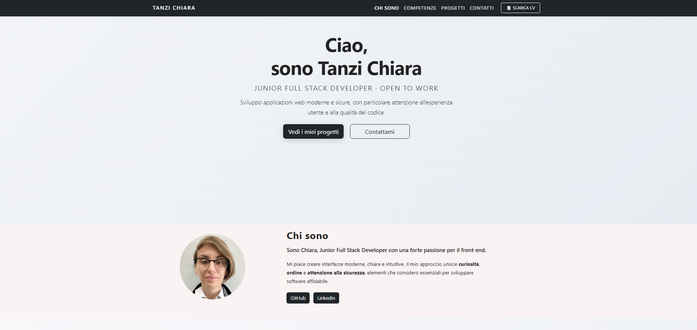
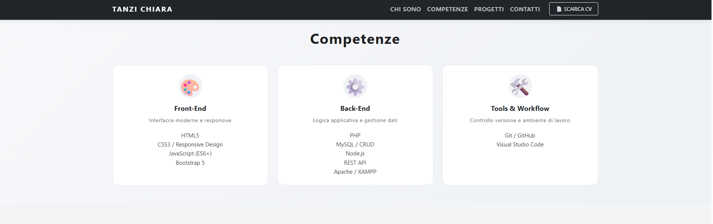
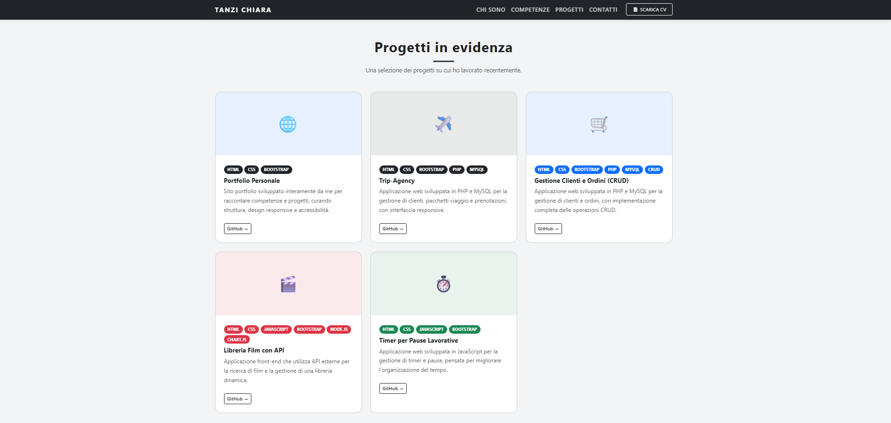
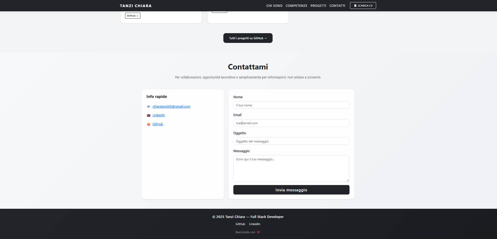

# Portfolio Personale

Portfolio personale sviluppato per presentare i miei progetti e il mio profilo
come **Junior Web Developer**.

Il sito è una single-page application statica, progettata con layout responsive e
particolare attenzione alla chiarezza dell’interfaccia, all’usabilità e alla
struttura del codice. Rappresenta uno spazio in continua evoluzione che racconta il mio percorso di
crescita nel mondo dello sviluppo web.

---

## 📸 Screenshot 

---

## Tecnologie utilizzate
- HTML5
- CSS3
- Bootstrap 5
- JavaScript

---

## Contenuto
- Sezione di presentazione
- Competenze tecniche
- Progetti sviluppati
- Contatti

---

## Progetti
Ogni progetto è descritto brevemente all’interno del sito e rimanda alla relativa
repository GitHub per maggiori dettagli.

---

## Stato del progetto
Il portfolio è in continuo aggiornamento e verrà progressivamente arricchito con
nuove funzionalità e progetti.

---

## Contatti
- GitHub: https://github.com/chiaratanzi00
- LinkedIn: https://www.linkedin.com/in/chiara-tanzi-7163121a1

---

## 👩‍💻 Autrice 
**Chiara Tanzi**